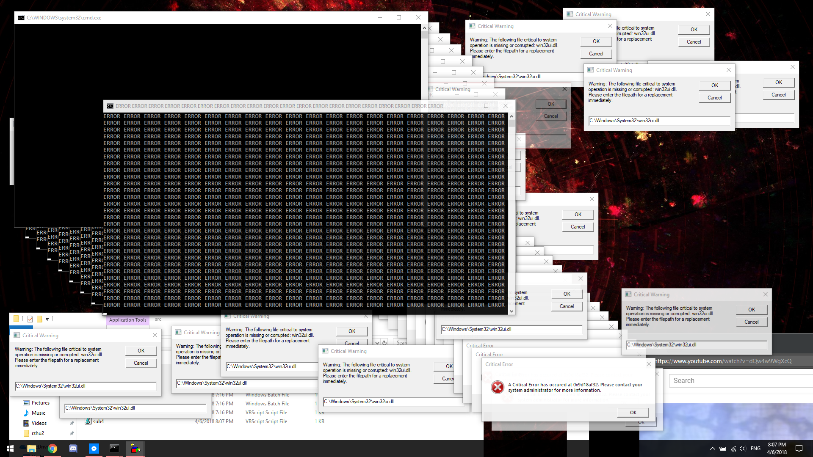

# Self Destruct
Self Destruct is an application that bombs your screen with errors and consoles, eats up CPU and memory, and eventually shuts your computer down. Additionally, it also plays a bunch of sounds by printing the BEL character continuously in console windows. This application is **not destructive** and was made for fun.

  

## Getting Started
To get started, simply download Self Destruct.exe and run it. That's it. Disable your antivirus if it thinks the file is suspicious.

Alternatively, you can also run the PowerShell script. The executable is just a packed version of the PowerShell script, so running either should be the same. Be sure to use Set-Executionpolicy to allow the script to run. You can also copy and paste the script into a PowerShell console.

Additionally, on Windows 10, you can create a shortcut to the script or executable and place it inside %appdata%\Microsoft\Windows\Start Menu\Programs and name it something like Self Destruct Sequence.lnk so you can run it by verbally saying "Hey Cortana, initiate self destruct sequence."

## How it Works
The PowerShell script or the executable attempts to load the scripts in src into a directory of that same name. If the src is already present, the program starts the main sequence by running main.bat. If the program lacks permission to load files, it will return an error to the user.

Main.bat triggers sub0.bat, which prints a block of text into the console for aesthetic purposes. It then starts sub1.bat, which starts a timed shutdown sequence after 13 seconds. After that, main.bat enters a loop where random x and y coordinates are generated and outputted into a file called sub4.vbs. Main.baat then proceeds to run sub2.bat, which periodically plays a sound by printing the BEL character periodically, sub3.bat, which prints an error containing technical gibberish, and sub4.bat, which prints an inputbox with the randomly generated coordinates with more technical gibberish.

The final result is a chaotic mess of consoles and error messages across the screen as well as a blast of sound from printing BEL characters. After 13 seconds, the computer shuts down.

## Why did you make this?
I was bored.

## License
This project is licensed under the MIT License - see the [LICENSE](LICENSE) file for details

  

